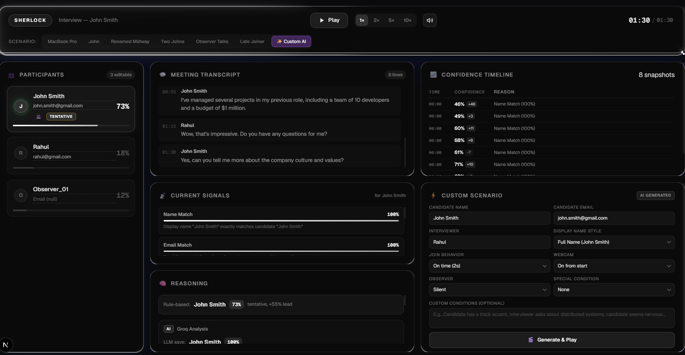
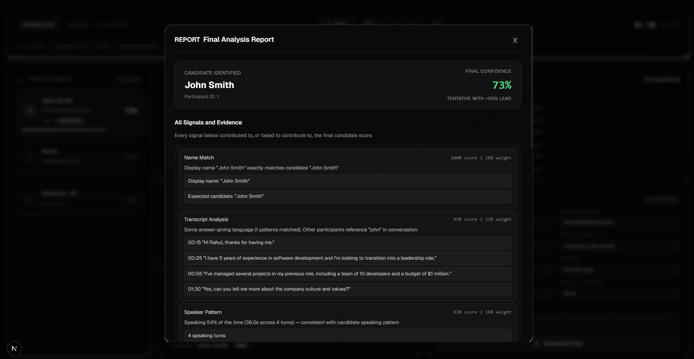
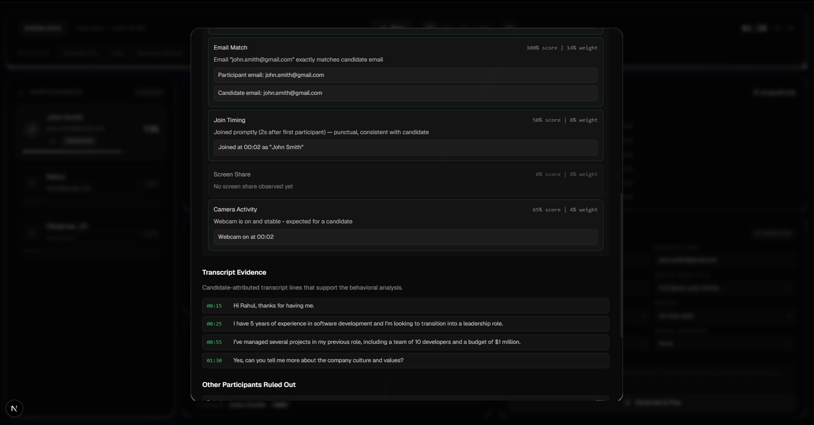
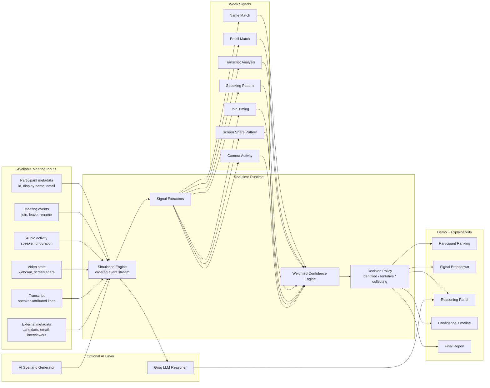

# Sherlock Candidate Identification Prototype

Sherlock is a real-time prototype for identifying the interview candidate during a live meeting. The goal is to decide which participant's audio/video stream should be routed into downstream fraud detectors such as deepfake detection, voice-clone detection, and behavioral analysis.

This project was built for the Sherlock internship challenge. It demonstrates candidate identification as a continuously updated confidence problem rather than a single name-matching rule.




## Problem

In live interviews, the candidate is not always obvious from meeting metadata.

Common failures include:

- Candidate joins as `MacBook Pro`, `iPhone`, or `Participant_47291`.
- Candidate uses a nickname or changes display name midway.
- Interviewer enters the wrong candidate name.
- Multiple interviewers or observers join the call.
- Another participant has a similar name.
- Observers may stay silent, or sometimes speak enough to confuse simple speaking-ratio rules.

Sherlock must identify the candidate with high confidence, explain the evidence, and gracefully remain uncertain when the data is weak.

## Demo Summary

The application simulates a live Google Meet style interview. It replays participant events, transcript lines, speaking activity, webcam state, screen-share state, and external calendar metadata in real time.

During playback, Sherlock:

- Scores every participant continuously.
- Selects the current candidate leader.
- Shows confidence and lead over the runner-up.
- Marks the decision as `CANDIDATE`, `TENTATIVE`, or `COLLECTING`.
- Shows which signals fired and why.
- Displays a confidence timeline as evidence arrives.
- Uses browser TTS so the demo sounds like a live interview.
- Highlights the active speaker with a pulsing avatar ring.
- Optionally calls Groq for an LLM reasoning pass.
- Can generate custom edge-case scenarios with AI.

## Tech Stack

- Next.js 16 App Router
- React 19
- TypeScript
- Framer Motion
- Browser SpeechSynthesis API for demo audio
- Optional Groq API for LLM reasoning and scenario generation

## Architecture Diagram



## Repository Structure

```text
app/
  api/generate/route.ts   Groq-powered custom scenario generator
  api/llm/route.ts        Groq-powered reasoning endpoint
  page.tsx                App entry point

components/
  Dashboard.tsx           Main realtime dashboard
  ParticipantsCard.tsx    Participant ranking + active speaker UI
  SignalsCard.tsx         Signal breakdown for current leader
  ReasoningCard.tsx       Rule-based and LLM explanations
  ConfidenceTimeline.tsx  Confidence changes over time
  ScenarioBuilder.tsx     Custom AI scenario controls
  ReportCard.tsx          Final analysis summary

hooks/
  useSimulation.ts        React bridge for the simulation engine
  useLLMReasoning.ts      Calls LLM periodically as transcript grows
  useAudio.ts             Browser-native text-to-speech playback

lib/
  simulation.ts           Event replay engine
  confidence.ts           Weighted candidate scoring engine
  scenarios.ts            Built-in deterministic edge cases
  signals/                Individual signal extractors
```

## How Candidate Identification Works

Every participant gets a score from multiple weak signals. Each signal returns:

- `score`: number from `0` to `1`
- `reason`: human-readable explanation
- `weight`: importance in the final confidence calculation

The weighted score is converted to a `0-100` confidence value. The top participant is treated as the current leader, but Sherlock only calls the participant confidently identified when both confidence and margin are high enough.

## Signal Weights

| Signal | Weight | Purpose |
| --- | ---: | --- |
| Name Match | 28% | Fuzzy match display name against candidate name |
| Transcript Analysis | 22% | Detect candidate-like language: self-introduction, answers, experience descriptions |
| Speaking Pattern | 16% | Candidate usually speaks more than observers and often more than interviewers |
| Email Match | 14% | Compare participant email with candidate calendar email |
| Join Timing | 8% | Weak signal based on join order and delay |
| Screen Share Pattern | 8% | Timing-aware signal for coding tasks, demos, or interviewer setup |
| Camera Activity | 4% | Webcam state is useful but weak alone |

Weights intentionally do not make any single signal decisive. This helps handle incorrect names and missing metadata.

## Decision Policy

The engine exposes three decision states:

| State | Meaning |
| --- | --- |
| `CANDIDATE` | Strong confidence and enough margin over second place |
| `TENTATIVE` | Current leader is plausible, but more evidence is preferred |
| `COLLECTING` | Evidence is too weak or ambiguous to safely route fraud detectors |

This is important in production. If Sherlock is unsure, it should keep observing or buffer streams instead of routing fraud detectors to the wrong participant.

## Built-in Evaluation Scenarios

The app includes six deterministic scenarios in `lib/scenarios.ts`.

| Scenario | Edge Case Tested | Expected Result |
| --- | --- | --- |
| MacBook Pro | Candidate joins with device name and no name match | Transcript, speaking pattern, screen share, and webcam recover identity |
| John | Candidate uses first name only | Partial name match plus transcript confirms |
| Renamed Midway | Candidate starts as random participant id, then renames | Confidence jumps after rename event |
| Two Johns | Candidate and observer have similar names | Self-introduction and answer behavior disambiguate |
| Observer Talks | Observer speaks frequently and asks questions | Question/observer language prevents false candidate selection |
| Late Joiner | Candidate joins late after pre-call chatter | Join timing is misleading, but name/transcript recover |

## Evaluation

### Testing Method

I evaluated the prototype with the built-in deterministic scenarios. Each scenario has a known ground-truth candidate participant (`participantId = "1"`). During each replay, the system recomputes scores after every event and the final decision is checked against the expected candidate.

I also manually tested custom scenarios generated from the UI, including:

- Candidate shares screen
- Candidate joins with full name
- Candidate joins with device name
- Silent observer
- Observer speaks
- Candidate webcam on/off variations

### Accuracy

On the six built-in deterministic scenarios, the expected final top-ranked participant is the candidate in all six cases.

| Metric | Result |
| --- | --- |
| Built-in scenario final selection | 6 / 6 |
| Scenario-level accuracy | 100% on included deterministic benchmark |
| Real-time behavior | Confidence updates as events arrive |
| Ambiguity behavior | Uses `TENTATIVE` / `COLLECTING` states before strong evidence |

This is not a claim of production accuracy. It is a prototype benchmark over intentionally designed edge cases.

### Edge Cases Covered

- Incorrect display names
- Missing participant email
- Partial first-name match
- Candidate display-name change
- Multiple similar names
- Talkative observer
- Late candidate join
- Screen sharing during candidate demo
- Webcam on/off behavior
- LLM reasoning disagreement vs rule-based score

### Limitations

- Signal weights are hand-tuned rather than learned from labeled data.
- Transcript analysis is heuristic and phrase-based.
- The LLM is used as an assistive reasoning layer, not a calibrated classifier.
- No real meeting SDK integration is included.
- No face recognition, lip-sync, voice biometrics, or device fingerprinting is implemented.
- Speaker attribution is assumed to be correct.
- The custom scenario generator depends on Groq and may produce imperfect data, so the backend normalizes some event streams.

## Setup

Install dependencies:

```bash
npm install
```

Run the development server:

```bash
npm run dev
```

Open:

```text
http://localhost:3000
```

## Environment Variables

The rule-based engine works without any API keys.

Optional Groq features require:

```bash
GROQ_KEY=your_groq_api_key
```

## Commands

```bash
npm run lint
npm run build
npm run dev
```


8. Discuss limitations and production improvements.

## Assumptions

- Meeting provider exposes participant IDs and separate audio/video streams.
- Transcript is speaker-attributed.
- Calendar metadata includes candidate name/email and interviewer names when available.
- The prototype replays simulated events instead of joining real Google Meet, Teams, or Zoom calls.
- Downstream fraud models are out of scope; this system identifies which participant those models should analyze.


## What I Would Add Next

These are the highest-value additions if there is more time:

1. Automated evaluation harness
   - Run every scenario headlessly.
   - Output final winner, confidence, margin, and time-to-identification.
   - Save results in README or `evaluation.md`.

2. Negative evidence model
   - Explicitly score participants down for known interviewer email domains, interviewer names, or observer behavior.

3. Calibration
   - Replace hand-tuned weights with logistic regression or gradient boosted trees trained on labeled meetings.
   - Report calibration error, not just accuracy.

4. Voice and face continuity
   - Add voiceprint consistency and face-track persistence signals.
   - These would help detect candidate swaps or proxy interviewers.

5. Real meeting integration
   - Connect to Meet/Teams/Zoom bot events.
   - Feed live transcript and participant stream state into the same scoring engine.

6. Safer uncertainty policy
   - When confidence is low, analyze all possible candidate streams at lower priority or wait for stronger evidence.

## Why This Approach Fits Sherlock

This prototype does not assume the candidate name is correct. It treats identity as a belief that updates over time. That matches the real production problem: names, emails, timing, audio, video, and transcript behavior are all imperfect, but together they can produce a reliable and explainable candidate decision.

