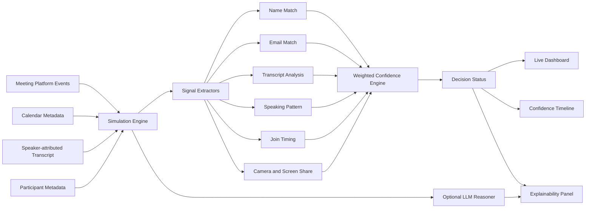

# Sherlock Candidate Identification Prototype

Real-time prototype for identifying the interview candidate in a live meeting using multiple weak signals, confidence scoring, and explainable reasoning.

The demo simulates Google Meet style participant events, speaker-attributed transcript lines, webcam/screen-share activity, participant metadata, and calendar metadata. As the meeting unfolds, Sherlock continuously recalculates which participant is most likely to be the candidate and explains the evidence behind the decision.

## What It Does

- Identifies the current candidate leader in real time.
- Updates confidence continuously as new events arrive.
- Combines weak signals instead of relying on one brittle rule.
- Handles bad or missing display names such as `MacBook Pro` or `Participant_47291`.
- Uses transcript behavior to distinguish candidates from interviewers and observers.
- Shows when the system is still collecting evidence instead of pretending to be certain.
- Optionally uses a Groq-hosted LLM for an additional reasoning pass.
- Includes an AI scenario generator for custom edge-case simulations.

## Architecture



## Scoring Approach

The core scorer lives in `lib/confidence.ts`. Each participant receives six signal scores from `0` to `1`, then the engine computes a weighted confidence score.

| Signal | Weight | Why it matters |
| --- | ---: | --- |
| Name match | 30% | Strong when reliable, but often missing or wrong |
| Transcript analysis | 22% | Candidates answer questions and describe experience |
| Speaking pattern | 18% | Candidates usually speak more than observers/interviewers |
| Email match | 15% | Strong calendar signal when available |
| Join timing | 10% | Useful weak signal, not decisive |
| Camera activity | 5% | Helpful but weak alone |

The current leader is marked as:

- `CANDIDATE` when confidence is high and the lead over second place is strong.
- `TENTATIVE` when the system has useful evidence but not enough margin.
- `COLLECTING` when the system should keep observing.

This is intentional: in production, a fraud detector should avoid sending audio/video to the wrong participant stream when evidence is weak.

## Built-in Scenarios

The demo includes six predefined edge cases:

| Scenario | Purpose |
| --- | --- |
| MacBook Pro | Candidate joins with a device name and no direct name match |
| John | Simple partial first-name match |
| Renamed Midway | Candidate changes display name during the meeting |
| Two Johns | Two participants have similar names, requiring disambiguation |
| Observer Talks | Observer speaks frequently and can confuse speaking-ratio logic |
| Late Joiner | Candidate joins late, so join timing becomes misleading |

## Setup

```bash
npm install
npm run dev
```

Open [http://localhost:3000](http://localhost:3000).

For LLM reasoning and AI-generated scenarios, create a `.env` file:

```bash
GROQ_KEY=your_groq_api_key
```

The rule-based engine works without the LLM key.

## Useful Commands

```bash
npm run lint
npm run build
```

Both commands should pass before submission.

## Assumptions

- The platform provides participant IDs, display names, join/leave events, webcam state, screen-share events, separate audio activity, and speaker-attributed transcripts.
- Calendar metadata includes expected candidate name, candidate email, and interviewer names when available.
- Audio/video streams are already separated by participant ID.
- This prototype simulates the meeting event stream rather than integrating directly with Google Meet, Teams, or Zoom SDKs.

## Evaluation

I tested the prototype against the six built-in scenarios above. The goal was not only to choose the right participant, but to show how confidence evolves as more evidence arrives.

| Edge case | Expected behavior |
| --- | --- |
| Wrong/missing candidate name | Transcript and speaking behavior compensate for weak name match |
| Candidate renames midway | Name score increases after the rename event |
| Multiple similar names | Transcript self-introduction and answer behavior disambiguate |
| Talkative observer | Observer may rise temporarily, but interviewer/question language and candidate answers correct the decision |
| Late candidate | Join timing is weak or negative, but transcript/name evidence recovers |
| Silent observers | Low speaking and webcam signals keep them low-confidence |

Current limitations:

- Signal weights are hand-tuned, not learned from a labeled dataset.
- Transcript analysis uses phrase heuristics; production should use a calibrated classifier or LLM-based structured extractor.
- No real face recognition, voice biometric, lip-sync, or device fingerprinting is implemented.
- The LLM is used for reasoning support, not as the sole source of truth.
- The simulation assumes clean speaker attribution.

## What I Would Improve Next

- Add a labeled evaluation harness with precision, recall, calibration error, and time-to-identification.
- Learn signal weights from historical interviews using logistic regression or gradient-boosted trees.
- Add active speaker/video alignment, face persistence, and voice-print continuity as additional signals.
- Add negative evidence explicitly, such as "known interviewer", "corporate domain", or "observer joined silently".
- Add a production policy layer: only route fraud detectors to a participant after `identified`, otherwise buffer or analyze all streams at low cost.
- Integrate with real meeting providers through bot/SDK event streams.

## Demo Video Outline

1. State the problem: Sherlock must identify the candidate stream before fraud detectors run.
2. Show the architecture diagram and explain the weak-signal approach.
3. Run the `MacBook Pro` scenario and show confidence increasing from transcript and behavior.
4. Run `Two Johns` or `Observer Talks` to demonstrate ambiguity handling.
5. Show the reasoning panel and confidence timeline.
6. Close with limitations and next steps.
